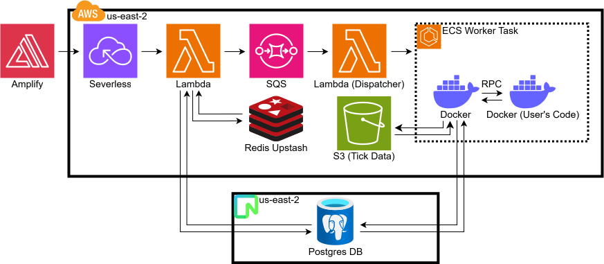

# Formulus

<p align="center">
  <a href="https://youtu.be/fCSm11IbmKw">
    
  </a>
</p>
<p align="center"><a href="https://youtu.be/fCSm11IbmKw">Watch the demo</a></p>

[formulus.ai](https://formulus.ai) is a SaaS application that consists of a frontend, a backend, and a backtesting worker. In total, the application has over 20,000 lines of code. At a high level, when a user has a strategy they wish to backtest, the user submits a request to the API, which adds the submission to a queue in AWS. The queue submission triggers a lambda dispatcher, which then starts a worker task. The worker fetches the appropriate submission from the database and then downloads the relevant tick data files and indices from S3. Since the user's code is possibly malicious, the worker initiates a Docker container and uploads the user's code to said container via a bind mount. Note that since the worker is an ECS task, this process creates an interesting docker-in-docker design.

The worker and container communicate via a stdin/stdout RPC, which is different depending on the programming language of the submitted code. After the backtest is completed or when the user code errors, the container containing the user's code is killed, and the backtesting results or errors, resp., are uploaded in the database, and the ECS task is terminated. Finally, on the frontend, users can view their results using the performance analysis dashboard.

<p align="center">
  
</p>

The key consideration kept in mind when determining how to migrate the project to the cloud was cost. I wanted something that was pay per use and cost only a couple of dollars a month, given there are not many users. EC2 instances that ran 24/7 were not an option. Thus, I choose a serverless architecture: AWS API Gateway routes to a monolithic Lambda function containing all bundled API code, which references Neon, a serverless PostgreSQL platform itself. Furthermore, Upstash (a serverless version of Redis) is used for rate limiting.

The backtesting worker infrastructure was more complicated. If cost were not as big of an issue, having a pool of workers that accept backtest submissions from the SQS queue would be ideal. Such a system would likely scale the number of workers based on the number of submissions in the queue. However, one cannot scale to 0, and as stated previously, even one constantly running Docker container is outside the budget of this project. As a result, it was decided that a Lambda dispatcher whose sole purpose was to invoke a Docker worker would suffice. This decision comes at a cost: if there are no warm EC2 instances available, an instance must be spun up before the backtest can run. This takes ~3 minutes. That said, if the user had recently made a backtesting request, an existing instance would be warm, and the expected latency would likely be less than 5 seconds.

## Technologies

The entire application is programmed in typescript. This was done not only out of familiarity; the `tRPC` libraries allow for strong type-checking between the frontend and backend, which proved to significantly enhance DX. Notice that TypeScript is also used for the worker code. This is because when first developing this project, the worker and API were merged together. In retrospect, they should have been separate entities from the beginning, with the API programmed in TypeScript and the worker in Python, considering the data handling that is done in the backtesting engine. Doing this would have presented less of a challenge.

The other relevant backend technologies used in the project are the following:

- [Express](https://www.npmjs.com/package/express)
- [Prisma](https://www.npmjs.com/package/prisma)
- [Docker](https://www.npmjs.com/package/dockerode)
- [Better Auth](https://www.npmjs.com/package/better-auth)
- [Stripe](https://www.npmjs.com/package/stripe)
- [Neverthrow](https://www.npmjs.com/package/neverthrow) (for error handling)
- [ESBuild](https://www.npmjs.com/package/esbuild)

The primary frontend technologies are the following

- [React](https://www.npmjs.com/package/react)
- [TanStack React Query](https://www.npmjs.com/package/@tanstack/react-query)
- [Tailwind](https://www.npmjs.com/package/tailwindcss)
- [D3](https://www.npmjs.com/package/d3)
- [Zustand](https://www.npmjs.com/package/zustand)
- [Vite](https://www.npmjs.com/package/vite)

To ensure code cleanliness [Eslint](https://www.npmjs.com/package/eslint) and [Prettier](https://www.npmjs.com/package/prettier) are both used in all parts of the codebase and must complete with exit 0 status in the CI/CD pipeline.

## Deployments

Formulus has three primary environments: development, staging, and production. All changes are pushed and tested rigorously in staging before being deployed to production. Both environments are cloud-hosted on AWS with identical cloud infrastructure.

Deployments are done through a GitHub Actions CI/CD pipeline. All environment variables are stored in GitHub Secrets, and cloud infrastructure is updated via the AWS CDK (see: `/infra` directory). One only needs to fast forward one of the following 6 branches to initiate a deployment.

| Branch           | Description                                                                                                                                                                                                                                                         |
| ---------------- | ------------------------------------------------------------------------------------------------------------------------------------------------------------------------------------------------------------------------------------------------------------------- |
| `client-prod`    | Updates the frontend for production ([formulus.ai](https://formulus.ai))                                                                                                                                                                                            |
| `api-prod`       | Deploys new API changes, applies new prisma migrations to the production database, and deploys the production SQS queue (api.formulus.ai)                                                                                                                           |
| `worker-prod`    | Builds the docker image for the worker and uploads it to ECR, builds the relevant docker images for containerizing the user’s code, and redeploys the lambda dispatcher, along with making all other necessary infrastructure changes to the production environment |
| `client-staging` | Updates the frontend for staging ([staging.formulus.ai](https://staging.formulus.ai))                                                                                                                                                                               |
| `api-staging`    | Deploys new API changes, applies new prisma migrations to the staging database, and deploys the staging SQS queue (api-staging.formulus.ai)                                                                                                                         |
| `worker-staging` | Builds the docker image for the worker and uploads it to ECR, builds the relevant docker images for containerizing the user’s code, and redeploys the lambda dispatcher, along with making all other necessary infrastructure changes to the staging environment    |

## How to Run Locally

> Before installing, one must have the necessary tick-data files. I have no problem sending the data to employers or possible contributors. However, I choose not to publicize it because I want to encourage the use of [formulus.ai](https://formulus.ai). Contact owensmith@uchicago.edu if interested.

**Setup**

1. Install [Node.js](https://nodejs.org/en/download) and [pnpm](https://pnpm.io/) (`npm i -g pnpm`)
2. Clone the repo and place tick data in `web-app/api/data`
3. Install dependencies:

   `/`

   ```powershell
   cd web-app; pnpm i; cd client; pnpm i; cd ../shared; pnpm i; cd ../api; pnpm i; cd ../worker; pnpm i
   ```

4. Populate environment variables (see `api/.env.sample`, `shared/.env.sample`, `worker/.env.sample`, and `client/.env.sample`)

   `api/.env.sample` leaves several values blank. The API won't start without them, so use placeholders for local dev.

   | Variable                                                     | Purpose                                                         |
   | ------------------------------------------------------------ | --------------------------------------------------------------- |
   | `BETTER_AUTH_SECRET`                                         | Session signing for [Better Auth](https://www.better-auth.com/) |
   | `GOOGLE_CLIENT_ID`, `GOOGLE_CLIENT_SECRET`                   | Google OAuth sign-in                                            |
   | `STRIPE_API_KEY`, `STRIPE_PRICE_ID`, `STRIPE_WEBHOOK_SECRET` | Stripe subscriptions and webhooks                               |
   | `COHERE_API_KEY`                                             | LLM-generated backtest names                                    |

   Generate `BETTER_AUTH_SECRET` with:

   ```powershell
   node -e "console.log(require('crypto').randomBytes(32).toString('base64'))"
   ```

**Stripe**

5. Install the [Stripe CLI](https://docs.stripe.com/stripe-cli/install) and run:

   ```powershell
   stripe listen --forward-to localhost:8080/api/stripe/webhook
   ```

6. Copy the printed webhook secret into `STRIPE_WEBHOOK_SECRET` in `api/.env`

**Docker**

7. Install [Docker Desktop](https://www.docker.com/products/docker-desktop/) and build the user container images:

   `/`

   ```powershell
   cd web-app/worker
   docker build -t formulus:cpp -f ./src/core/backtesting/rpc/dockerfiles/cpp.Dockerfile .
   docker build -t formulus:typescript -f ./src/core/backtesting/rpc/dockerfiles/typescript.Dockerfile .
   ```

**Run**

8. Start local infrastructure (Postgres, Redis, LocalStack):

   `/web-app/`

   ```powershell
   docker compose up -d
   ```

9. Migrate the database:

   `/`

   ```powershell
   cd web-app/api; pnpm run prisma:migrate
   ```

10. Start the API, worker, and client in separate terminals:

    `/`

    ```powershell
    cd web-app/api; pnpm run start
    cd web-app/worker; pnpm run start
    cd web-app/client; pnpm run start
    ```
